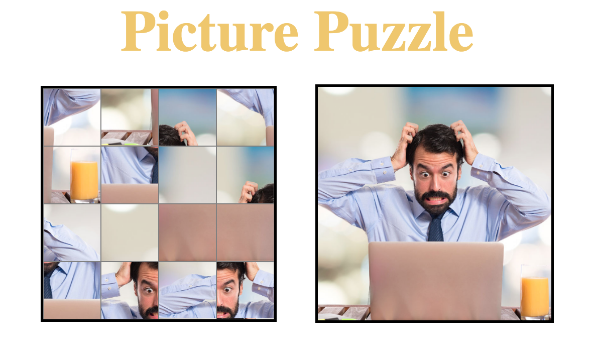

This is a sliding picture puzzle made in JavaScript, HTML, CSS using a stock photo of an office worker. The idea is to slide the randomized tiles into the correct spaces using mouse left clicks. The game is played on a four by four game board and this version will include a timer of 100. 

In the future I would like to include some functionality that allows you to upload a picture to the puzzle, that crops the photo appropriately, and cuts it into 16 seperate grid cells

AAU I long for the days of a simple picture puzzle on a 10 hour car ride, so lets do that but with comical stock photos

AAU I want to be able to drag and upload photos to the shuffler