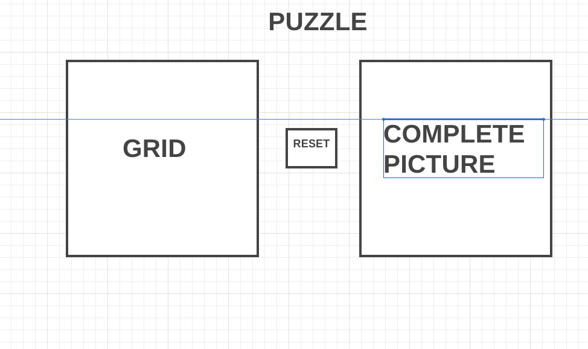

## OVERLY STRESSED OFFICE GUY

Made with JavaScript, HTML, CSS

This is a sliding picture puzzle using a stock photo of an office worker. The idea is to move the randomized tiles into the correct spaces using mouse left clicks. The game is played on a four by four game board and this version will include a timer of 100.

AAU I long for the days of a simple picture puzzle on a 10 hour car ride, so lets do that but with comical stock photos

AAU I want to be able to drag and upload photos to the shuffler

### WIRE FRAME:

### SCREEN SHOT:

### PLAY HERE:
and here is a link to the game: 
[OVERLY STRESSED OFFICE GUY](https://connermccabe.github.io/JS-Overly-Stressed-Office-Guy/)

### NEXT STEPS:
In the future I would like to include some functionality that allows you to upload a picture to the puzzle, that crops the photo appropriately, and cuts it into 16 seperate grid cells.
Or just add some more sweet annoying features like a grid that jumps away from you as the timer goes down, maybe make the title shake and take away the big picture.
